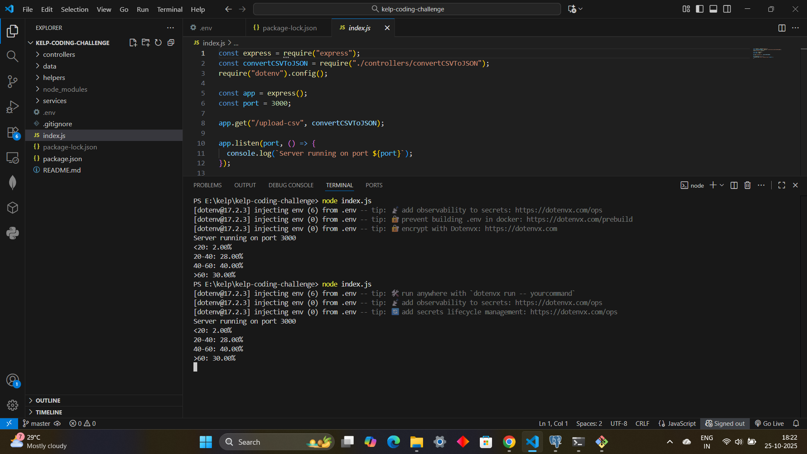
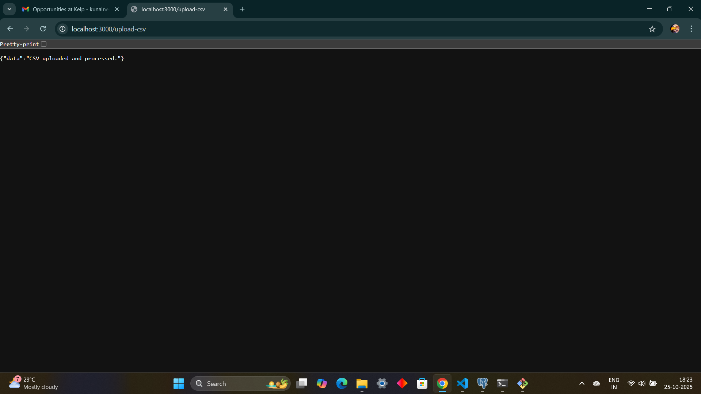
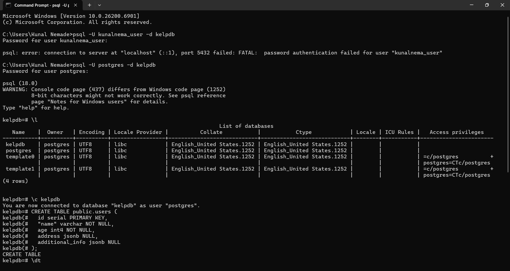
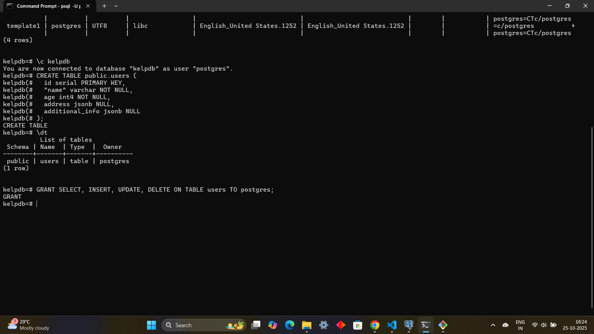
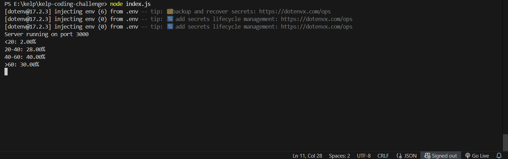

# CSV to JSON Converter API (Node.js + Express JS)

This project is a CSV to JSON Converter API built with Node.js (Express.js) that parses CSV files, converts them into JSON objects, and uploads the processed data into a PostgreSQL database it then prints an age distribution report to the console.

---

## Features

- Parses CSV with complex nested keys (e.g., `name.firstName`, `address.line1`)
- Transforms and inserts data into a PostgreSQL `users` table
- Ignores external CSV libraries (uses custom logic)
- Computes age-group distribution
- Handles large CSV files effectively & efficiently
- First line in the csv file will always be labels for the properties
- Number of records in the file can go beyond 50000
- You can have properties with infinite depth. (a.b.c.d........z.a1.b1.c1.....)
- All sub-properties of a complex property will be placed next to each other in the file.

---

## Technologies Used

- Node.js (Express)
- PostgreSQL
- JavaScript

---

## Project Structure

```
kelp-coding-challenge/
│
├── index.js               # Entry point for the application
├── .env                   # Environment configuration and hides the sensitivity
├── README.md              # Project documentation
├── package.json           # Project dependencies and scripts
│
├── controllers/           # Route controllers
│   └── convertCSVToJson.js
│
├── services/              # Business logic and service functions
│   ├── getAgeDistribution.js
│   ├── insertUsers.js
│   ├── parseCSV.js
│   └── transformObjects.js
│
└── helpers/               # Utility/helper functions
    └── postgresConnection.js

```

---

## Environment Variables

Create a `.env` file and make the suitable chnages according to your DB structure :

```
CSV_FILE_PATH=./users.csv
DB_HOST=localhost
DB_PORT=5432
DB_NAME=your_database_name
DB_USER=your_user_name
DB_PASS=your_password
```

---

## Sample CSV

Download a test file here: [users.csv]  (./users.csv)

---

## How to Run

### 1. Install dependencies

```bash
npm install
```

### 2.Install & Start PostgreSQL and create table

Create a DB (for example : kelpdb) and run this SQL to create the `users` table:

```sql
CREATE TABLE public.users (
  id serial PRIMARY KEY,
  "name" varchar NOT NULL,
  age int4 NOT NULL,
  address jsonb NULL,
  additional_info jsonb NULL
);
```

### 3. Start the server

```bash
node index.js
```

### 4. Upload and process the CSV

Open any web browser and paste / access the API so that the GET request is fired:

```
http://localhost:3000/upload-csv
```

---

##  Output

After processing, it will print the output in the following format:

```
<20: 2.00%
20-40: 28.00%
40-60: 40.00%
>60: 30.00%
```











---

##  Assumptions

- The CSV file uses a comma `,` as a delimiter.
- No quotes are used to wrap fields, even those containing commas.
- Headers in the CSV file follow a dot (`.`) notation for nesting (e.g., `address.city`).
- All records have at least `name.firstName`, `name.lastName`, and `age`.
- Sub-properties of complex properties appear next to each other in the CSV.
- CSV file is well-formed with no empty rows.
- All other fields besides name and age will be grouped under `address` (if they match), and the rest into `additional_info`.
- Only standard ASCII characters are expected in the input CSV.

---

